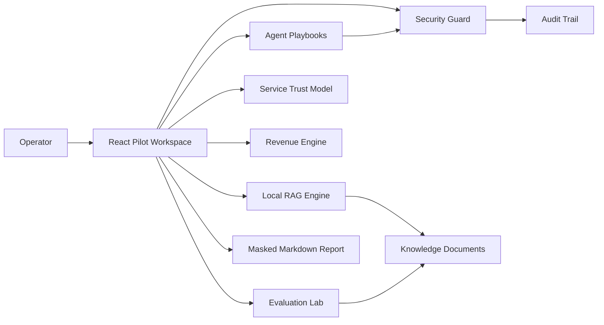

# AIX Pilot Portfolio Case Study

## One-line

AIX Pilot is a local-first Enterprise GenAI pilot workspace that combines RAG, agent workflows, DLP masking, auditability, KPI tracking, and evaluation gates without paid APIs.

## Why This Exists

Many GenAI demos stop at a chat box. Enterprise adoption fails later because teams cannot answer the harder questions: which document grounded the answer, who owns the content, whether PII leaked, which actions need approval, and how the pilot will be judged after six weeks.

AIX Pilot is built to show those operational answers upfront. It is intentionally small enough to run for free, but structured like a product that can graduate into a real enterprise pilot.

## Product Scope

| Area | Built Into Demo | Recruiter Signal |
|---|---|---|
| RAG | Local chunking, Korean-friendly tokenization, search ranking, citation dedupe | Retrieval quality and evidence discipline |
| Agent | FAQ, email, report, automation modes with approval steps | Workflow thinking beyond a chatbot |
| Security | Phone, email, resident-number pattern, sensitive keyword detection and masking | Responsible AI and privacy awareness |
| Service Trust | Launch readiness score, trust controls, SLOs, maturity track | Product/infra ownership beyond UI polish |
| Revenue | ROI calculator, pricing tiers, buyer psychology, adoption culture | Commercial product thinking and ethical monetization |
| KPI | Adoption, RAG quality, automation, cost, risk dashboards | Product measurement mindset |
| Evaluation | Golden question suite with retrieval, citation, safety score | Regression testing for AI behavior |
| Spec Pack | Requirements, rollout phases, gates, stack decisions | Enterprise handoff and execution clarity |
| Visual System | Original generated hero image and local GIF motion asset | Design taste with copyright-safe assets |

## Architecture Summary

## Engineering Decisions

| Decision | Reason |
|---|---|
| Local-first browser demo | Free to run, no API key exposure, easy for reviewers to start |
| Deterministic RAG and agent outputs | Stable tests and predictable interview demo behavior |
| Golden evaluation suite | AI features need acceptance criteria, not only screenshots |
| DLP before export | Report downloads should not become the privacy leak |
| Spec Pack in the product UI | Enterprise buyers and internal platform teams need the operating model, not just the prototype |

## Quality Bar

The repository is designed so the reviewer can inspect product, code, and governance artifacts together.

- `npm run qa` runs TypeScript, Vitest, and production build.
- `src/lib/evaluation.test.ts` keeps the golden suite above the pilot acceptance bar.
- `src/lib/serviceReadiness.test.ts` checks launch readiness, blocker behavior, and service model completeness.
- `src/lib/revenue.test.ts` checks ROI, price anchoring, weak-case restraint, and business model completeness.
- `src/lib/report.test.ts` verifies raw phone and email values do not leak into reports.
- Browser QA screenshots validate desktop, mobile, and Spec Pack layouts.
- `npm run qa` keeps the same quality gate ready for CI wiring.
- Brand visuals live under `public/brand` and are original project assets, not stock imagery.

## Demo Talk Track

1. Start with the top `실행` button to run a realistic shipping-delay customer scenario.
2. Show RAG citations and confidence, then switch Agent modes.
3. Point out that the phone number is masked in the Agent output and report.
4. Open Evaluation Lab to show retrieval, citation, safety, and confidence scores.
5. Open Service Trust Model to show launch readiness, controls, SLOs, and blockers.
6. Open Revenue Engine to show ROI, pricing, buyer objections, and culture-aware adoption.
7. Finish with Enterprise Spec Pack to show rollout, security gates, requirements, and stack decisions.

## Production Path

| Pilot | Production Upgrade |
|---|---|
| Local TF-IDF | Qdrant or Chroma with hybrid search and reranker |
| Rules-based draft generation | Approved model gateway or local LLM through Ollama/vLLM |
| Pattern DLP | Presidio, OPA, SIEM integration |
| Browser audit log | Server-side append-only audit store |
| Static dashboard | Internal portal with SSO/RBAC |

## What This Shows

This project is meant to signal end-to-end product engineering: shipping UI, robust TypeScript, deterministic AI evaluation, privacy controls, operational documentation, and a realistic path from free PoC to enterprise rollout.
