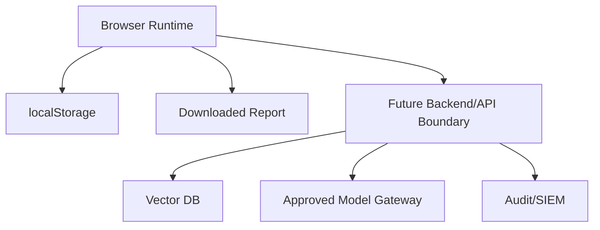

# AIX Pilot Threat Model

## Scope

This threat model covers the local-first AIX Pilot prototype and the expected path to an enterprise GenAI pilot. The current app does not call external APIs, but it still models the controls required before real customer or employee data is introduced.

## Assets

| Asset | Risk | Current Control |
|---|---|---|
| User prompts | PII or confidential data may be entered | DLP scan, masking, audit trail |
| RAG documents | Restricted documents may be surfaced to the wrong user | Sensitivity metadata, production RBAC requirement |
| Agent drafts | External messages may contain unsafe content | Human approval gate, masked preview |
| Reports | Downloaded files can leak raw identifiers | `buildPilotReport` applies masking |
| Audit logs | Logs may store sensitive prompts | Masked summaries and retention policy guidance |

## Trust Boundaries

## Abuse Cases

| Abuse Case | Impact | Mitigation |
|---|---|---|
| User enters phone, email, resident-number pattern | PII exposure in answer or report | DLP detection and masking tests |
| Agent drafts an external email without architecture | Incorrect or risky customer communication | Human approval badge and playbook steps |
| RAG retrieves a restricted document | Unauthorized knowledge disclosure | Production RBAC and allowed-role metadata requirement |
| Prompt asks for secrets or security exception | Sensitive operational leakage | Sensitive keyword detection and security gate |
| Prompt asks to ignore instructions or reveal system prompts | Prompt injection, policy bypass, unsafe disclosure | Prompt Injection Guard and high-risk launch penalty |
| API key or token-like value appears in prompt or document | Credential leakage | Token-shaped secret detection and masking |
| Report export stores raw identifiers | Durable privacy incident | Report masking regression test |
| Uploaded document pollutes retrieval results | Bad answer quality or misleading evidence | Evaluation Lab and golden regression suite |

## Current Controls

- Phone, email, resident-registration pattern, token-shaped secret, prompt injection, and sensitive keyword detection.
- Masked Agent preview and masked Markdown report export.
- Citation dedupe by source document.
- Audit trail for RAG, scenario, upload, and report actions.
- Service readiness score that penalizes high-risk findings before launch.
- Enterprise Spec Pack requiring RBAC, DLP, audit retention, and HITL before production.
- Vitest coverage for RAG, Agent, Security, Report, Spec Pack, and Evaluation.

## Residual Risks

| Risk | Why It Remains | Required Before Production |
|---|---|---|
| Browser-only localStorage is mutable | It is sufficient for demo, not compliance | Server-side append-only audit store |
| No real user identity | Prototype has no SSO session | SSO/RBAC with document-level authorization |
| Pattern DLP has false negatives | Regex is not semantic DLP | Presidio or enterprise DLP integration |
| Local ranking is not enough for large corpora | TF-IDF is a free baseline | Vector DB, hybrid search, reranker, eval set |
| No model policy enforcement | Rules-based demo avoids API risk | Approved model gateway and logging policy |

## Production Security Checklist

- Define document `allowed_roles` and enforce it before retrieval.
- Store audit logs server-side with retention and deletion policy.
- Add approval routing for external messages, refunds, permissions, and security exceptions.
- Run DLP before model invocation, after model output, and before report export.
- Keep an offline golden evaluation set for each business workflow.
- Add incident runbooks for PII leak, wrong answer, retrieval authorization bug, and model outage.
