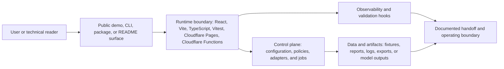

# System Architecture - aix-pilot

This document is the system-level architecture attachment for the repository. It keeps the technical stack, runtime boundary, data/control flow, deployment surface, and operating assumptions in one place.

## Architecture Summary

| Area | Design |
| --- | --- |
| Repository | `aix-pilot` |
| Primary domain | enterprise GenAI pilot operations |
| Primary stack | React, Vite, TypeScript, Vitest, Cloudflare Pages, Cloudflare Functions |
| Architecture axes | cloud architecture, AI engineering, governance, evaluation, security, operator experience |

Browser-first GenAI pilot console with local RAG fixtures, agent drafts, DLP masking, KPI dashboards, evaluation tests, and Cloudflare deployment path.

## Runtime And Data Flow



Primary domain: enterprise GenAI pilot operations.

## Stack Surface

| Layer | Current surface | Operating note |
| --- | --- | --- |
| Interface | Public demo, README, CLI, package, or static proof surface depending on repository shape | Keep the first screen or command path inspectable without private credentials. |
| Runtime | React, Vite, TypeScript, Vitest, Cloudflare Pages, Cloudflare Functions | Keep runtime adapters bounded by environment configuration and documented fallbacks. |
| Control plane | Policies, configuration, job orchestration, tests, and release scripts | Keep operator-impacting changes traceable through docs and validation hooks. |
| Data and artifacts | Fixtures, generated reports, screenshots, exports, logs, or model outputs | Keep sample and generated artifacts clearly separated from private or customer data. |
| Operations | CI, local validation, architecture guard, and handoff notes | Keep the architecture docs current when runtime, data, or deployment boundaries change. |

## Cloud Or Local Deployment Boundary

Operating model: static-first enterprise pilot console with optional Cloudflare runtime edges for API adapters, workspace state, and controlled service expansion

### Deployment patterns

- Static frontend with runtime adapters isolated behind Cloudflare Functions
- Manual Cloudflare Pages deployment workflow that re-runs QA before publishing
- Local deterministic fallback for RAG, agent draft, DLP, KPI, and report demos

### Control boundaries

- identity boundary and least-privilege service access
- environment separation for local, preview, and managed deployment paths
- secret storage outside source and deterministic fallback for missing credentials
- audit-friendly workspace events for generated drafts and report exports
- rollback path through static build artifacts and GitHub Actions deployment history

### Resilience controls

- deterministic QA command covering typecheck, tests, and production build
- model-free fallback paths for demo operation when external providers are unavailable
- explicit service-readiness scoring before pilot claims are trusted
- bounded browser-local state with reset and report export controls

## AI And Automation Boundary

Operating model: retrieval-backed knowledge answers, agent drafts, safety checks, evaluation scorecards, and value-readiness signals that stay inspectable without external credentials

### Engineering patterns

- Keep source documents, retrieval scores, owners, recency, and answer evidence visible beside generated output
- Separate deterministic DLP and security checks from agent draft text so the system remains testable
- Treat generated emails, reports, and automation drafts as human-approved artifacts
- Preserve evaluation fixtures and golden questions as CI-safe regression gates
- Keep value readiness signals tied to explicit operational assumptions instead of hidden model output

### Evaluation and model-risk controls

- Vitest coverage for RAG ranking, agent drafting, DLP masking, value readiness calculations, and service-readiness scoring
- golden question fixtures for retrieval quality and citation behavior
- content and build checks in npm run qa before deploy
- production dependency audit in GitHub Actions

### Risks to keep explicit

- stale knowledge source metadata
- unsafe automation without approval
- private data leakage in reports or screenshots
- overconfident adoption claims
- external provider outage or quota exhaustion

## Attached Architecture References

- [Service architecture](service-architecture.md)
- [Cloud + AI architecture](cloud-ai-architecture.md)
- [Architecture manifest](architecture/blueprint.json)
- [Product operating model](product-operating-model.md)
- [Quality gate](quality-gate.md)

## Local Architecture Guard

```bash
python3 scripts/validate_architecture_blueprint.py
```

CI workflow: `.github/workflows/architecture-blueprint.yml`.

Update this document whenever runtime entrypoints, data stores, hosted services, model/provider boundaries, or operating assumptions change.
